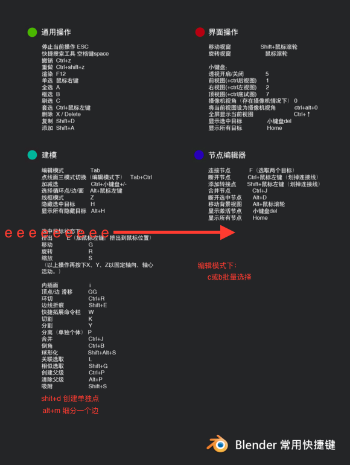

# 物体中心点设置

## 1、shift + s --> 游标-中心点

## 2、shift + s --> 选中项-游标

## 3、选中物体，切换到编辑模式 shift + s --> 选中项-游标（偏移）

## 4、切换到物体模式

# 常用快捷键

## 1、Tab  当前模式和编辑模式切换

## 2、Ctrl + Tab 切换到骨架模式

## 3、Shit + C 恢复默认观察视角

## 4、Z 线框和实体的转换

## 5、Ctrl + Alt + Q 四视图和单视图切换

## 6、G 移动物体

## 7、Shift + A 添加物体

## 8、Shift + D 复制

## 9、Shift + 中建 移动

## 10、Shift + space 当前窗口最大化

## 11、Alt + Z 渲染模式和物体模式切换ΩΩ

## 其他

